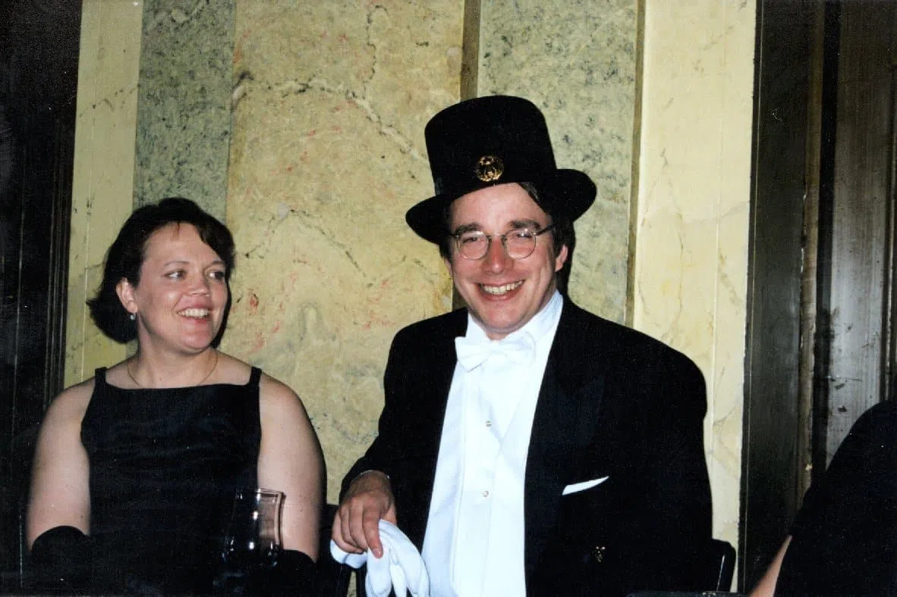
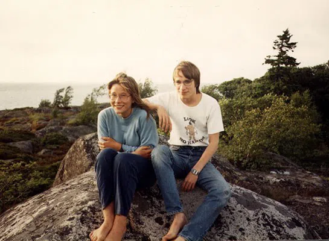
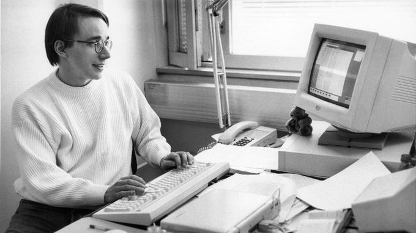
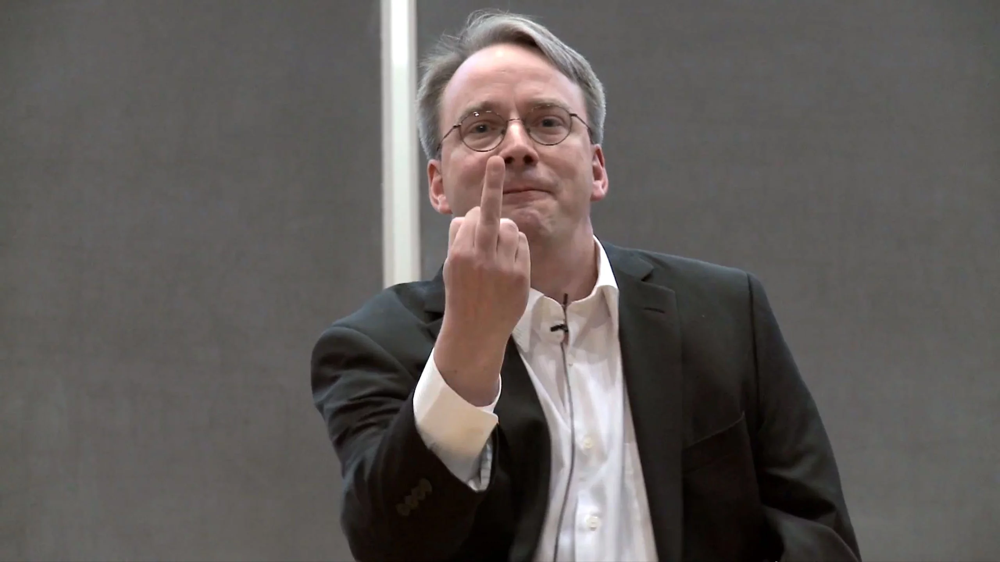

[Voltar](intro.md)

# Álbum de fotos

|  |
|:--:|
| <b>Linus, em 2019, após completar 50 anos. Foto disponível em [Reddit](https://www.reddit.com/r/linux/comments/egkvpc/linus_torvalds_turns_50_today_wish_him_best_for/).</b>|

|  |
|:--:|
| <b>Linus Torvalds com a esposa Tove Torvalds. Foto disponível em [Reddit](https://www.reddit.com/r/GirlsMirin/comments/88y18v/tove_torvalds_mirin_her_husband_linus_torvalds/).</b>|

## Juventude e Faculdade

|  |
|:--:|
| <b>Linus, cerca de 1991. Foto disponível em [Código-Fonte](https://www.codigofonte.com.br/noticias/linux-completa-25-anos).</b>|

|  |
|:--:|
| <b>Linus bebendo cerveja. Foto disponível em [Fudzilla](https://www.fudzilla.com/news/50106-torvalds-warns-against-oracle-module).</b>|

|  |
|:--:|
| <b>Um jovem Linus Torvalds com sua irmã jornalista Sara Torvalds. Foto disponível em [Livre e Aberto](https://livreeaberto.com/fatos-sobre-linus-torvalds).</b> |

## Linux

|  |
|:--:|
| <b>Linus em 1994. Foto disponível em [O Eduardo Moreira](https://www.oeduardomoreira.com.br/o-linux-completou-30-anos/).</b>|

|  |
|:--:|
| <b>Linus com o Linux. Foto disponível em [TechTudo](https://www.techtudo.com.br/noticias/2011/11/conheca-linus-torvalds-o-criador-do-linux.ghtml).</b>|

|  |
|:--:|
| <b>Linus Torvalds em 2012, mostrando o dedo do meio para a Nvidia. Fotos disponível em [Tecnoblog](https://tecnoblog.net/noticias/2018/09/17/linus-torvalds-folga-pede-desculpas/).</b>|

|  |
|:--:|
| <b>Linus com a mascara do mascote do Linux. Foto disponível em [Adrenaline](https://adrenaline.com.br/noticias/v/64216/linus-torvalds-troca-para-amd-apos-15-anos-usando-sistemas-intel).</b>|

## Hoje em dia

|  |
|:--:|
| <b>Linus em seu ambiente de trabalho. Foto disponível em [Adrenaline](https://adrenaline.com.br/noticias/v/67379/criador-do-linux-critica-intel-por-matar-a-industria-de-memorias-ecc).</b>|

|  |
|:--:|
| <b>Linus em uma conferência TED em 2016. Foto disponível em [Linux Descomplicado](https://www.linuxdescomplicado.com.br/2016/04/linus-torvalds-a-mente-por-tras-do-linux-ted2016.html).</b>|

|  |
|:--:|
| <b>Linus em debate sobre a superioridade da AMD sobre a Intel. Foto disponível em [Hardware](https://www.hardware.com.br/noticias/2021-01/linus-torvalds-criador-do-linux-critica-intel-e-elogia-amd.html).</b>|
