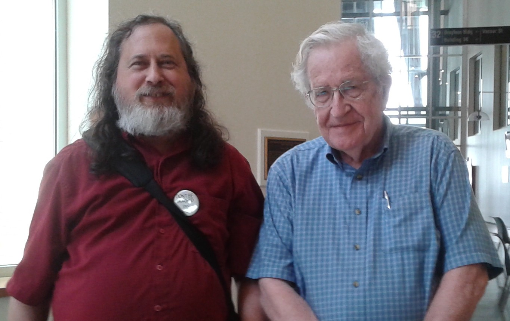

[Voltar](intro.md)

Álbum de fotos
====
|  |
|:--:|
| <b>Richard Stallman encontrando com Noam Chomsky pela primeira vez em 2015 no campus do MIT em Cambridge, Massachusetts. Na ocasião, dentre os assuntos discutidos, estavam presentes a pauta do *Free Software Movement* (FSM) e Gerenciamento de restrições digita. Foto disponpivel em [Agaric](https://agaric.coop/blog/noam-chomsky-and-richard-stallman-meeting-one)</b>|

|  |
|:--:|
| <b>Richard Stallman em palestra, realizada na UNICAMP, sobre software livre em 2017. Foto disponpivel em [Unicamp](https://www.unicamp.br/unicamp/banco-de-imagens/2017/06/02/palestra-sobre-software-livre-com-richard-stallman-na-unicamp#)</b>|

